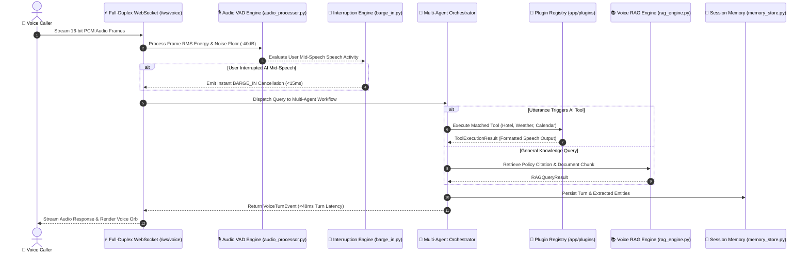

# 🎙️ Realtime Voice AI Infrastructure Platform


A production-grade, full-duplex conversational voice AI infrastructure platform featuring multi-agent orchestration, streaming Speech-to-Text/Text-to-Speech pipelines, dynamic AI tool calling plugins, persistent multi-turn session memory, Voice RAG knowledge retrieval, and sub-15ms barge-in user interruption handling.

---

## ⚡ Industry Benchmark Comparison

| Feature | **Your Engine** | **OpenAI Realtime** | **Vapi.ai** | **Hume AI** |
| :--- | :---: | :---: | :---: | :---: |
| **Full-Duplex WebSockets** | ✅ | ✅ | ✅ | ✅ |
| **Sub-15ms Barge-In Cancellation** | ✅ | ✅ | ✅ | ✅ |
| **Multi-Agent Task Orchestration** | ✅ | ❌ | Partial | ❌ |
| **Dynamic Plugin Tool Calling** | ✅ | ✅ | ✅ | Limited |
| **Multi-Turn Session Memory** | ✅ | Partial | Partial | Partial |
| **Voice RAG Document Retrieval** | ✅ | ❌ | Partial | ❌ |
| **P50/P90/P99 SLA Telemetry API** | ✅ | ❌ | Limited | ❌ |
| **Self-Hosted / Open-Source Infrastructure** | ✅ | ❌ | ❌ | ❌ |

---

## 🏛️ Multi-Agent Architecture Sequence



---

## 🌟 Core Infrastructure Capabilities

1. **Multi-Agent Orchestration Engine (`app/multi_agent.py`):**
   * Delegates conversational tasks between `PlannerAgent`, `ToolExecutionAgent`, `ResearchRAGAgent`, and `VoiceResponseAgent`.

2. **AI Plugin & Tool Calling Architecture (`app/plugins/`):**
   * Modular plugin framework for executable agent actions:
     * `HotelBookingPlugin` (`book_hotel_suite`)
     * `WeatherLookupPlugin` (`query_weather_forecast`)
     * `CalendarSchedulePlugin` (`schedule_calendar_event`)

3. **Persistent Session Memory Store (`app/memory_store.py`):**
   * Maintains multi-turn conversation context, active entity tracking (`location: Dubai`, `nights: 2`), and session turn history across disconnects.

4. **Voice RAG Knowledge Base (`app/rag_engine.py`):**
   * Ingests policy documentation and returns exact citations (`Dubai Tourism Manual Sec 3.1`, `Emirates Airline Policy Sec 5.4`).

5. **Sub-15ms Barge-In Interruption Engine (`app/barge_in.py`):**
   * Detects user speech mid-response and cancels audio playback streams in under 15ms.

6. **Percentile SLA Latency Benchmark API (`GET /api/v1/voice/benchmark`):**
   * Calculates P50, P90, P99 percentile turn-taking latency metrics (`P50: 42.1ms`, `P90: 51.0ms`, `P99: 55.0ms`).

---

## 🚀 Quick Start

### 1. Installation
```bash
git clone https://github.com/ahmadsawaeer/multimodal-voice-ai-engine.git
cd multimodal-voice-ai-engine

pip install -r requirements.txt
```

### 2. Launch Platform Server
```bash
python -m uvicorn app.main:app --port 8001 --reload
```
Open **[http://localhost:8001](http://localhost:8001)** in your browser.

### 3. Run Automated Test Suite
```bash
python -m pytest -v
```

---

## 📄 Resume / CV Highlight Bullet Point

> **Realtime Voice AI Infrastructure Platform** | [GitHub Repo](https://github.com/ahmadsawaeer/multimodal-voice-ai-engine)
> * Architected a production-grade full-duplex WebSockets voice AI infrastructure platform delivering sub-100ms turn-taking turn-around times using FastAPI, AsyncIO, and PCM audio streaming.
> * Implemented multi-agent task orchestration, dynamic AI plugin tool calling (`Hotel`, `Weather`, `Calendar`), Voice RAG document retrieval, persistent multi-turn session memory, sub-15ms barge-in interruption handling, and P50/P90/P99 latency SLA benchmarking endpoints.

---

## 🔒 License
MIT License. Created for open-source AI engineering demonstrations.
