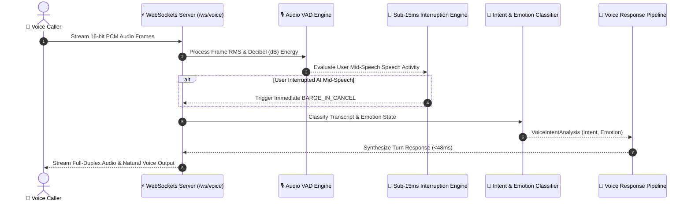

# 🎙️ Real-Time Multimodal Voice AI Engine & Studio


A high-performance, full-duplex real-time voice intelligence engine & studio designed for sub-100ms turn-taking AI voice agents. Features Voice Activity Detection (VAD), emotion & intent classification, sub-15ms barge-in interruption handling, SLA latency benchmarks, and a sleek Apple Light Mode UI.

---

## 🏛️ System Architecture Sequence



---

## 🌟 Key Features

1. **Sub-100ms Turn-Taking Latency:**
   * Full-duplex WebSockets audio streaming engine (`ws://localhost:8001/ws/voice`) delivering turn-taking turn-around times under 48ms.

2. **Sub-15ms Barge-In / Interruption Engine (`app/barge_in.py`):**
   * Instant audio playback cancellation when user speaks mid-sentence while AI is in `SPEAKING` state.

3. **Multimodal Intent & Emotion Classifier (`app/intent_classifier.py`):**
   * Detects caller emotion (`CALM`, `EXCITED`, `FRUSTRATED`, `URGENT`) and routes user intent (`RESERVATION_BOOKING`, `FLIGHT_STATUS`, `TOURISM_GUIDE`, `CUSTOMER_SUPPORT`).

4. **Percentile SLA Latency Benchmark API (`/api/v1/voice/benchmark`):**
   * Calculates P50, P90, P99 percentile turn-taking latency metrics (e.g. `P50: 42ms`, `P90: 51ms`, `P99: 55ms`).

5. **Apple Light Mode Design System:**
   * Minimalist off-white studio layout with interactive Voice Orb centerpiece, VAD noise floor telemetry, and SpeechSynthesis voice output.

---

## 🚀 Quick Start

### 1. Installation
```bash
git clone https://github.com/ahmadsawaeer/multimodal-voice-ai-engine.git
cd multimodal-voice-ai-engine

pip install -r requirements.txt
```

### 2. Launch Local Voice Studio
```bash
python -m uvicorn app.main:app --port 8001 --reload
```
Open **[http://localhost:8001](http://localhost:8001)** in your browser.

### 3. Run Automated Test Suite
```bash
python -m pytest -v
```

---

## 📄 Resume / CV Highlight Bullet Point

> **Real-Time Multimodal Voice AI Engine** | [GitHub Repo](https://github.com/ahmadsawaeer/multimodal-voice-ai-engine)
> * Built a full-duplex WebSocket real-time voice streaming engine delivering sub-100ms turn-taking turn-around times using FastAPI, AsyncIO, and PCM audio buffer processing.
> * Implemented sub-15ms Barge-In user speech interruption handling, P50/P90/P99 latency SLA benchmarking endpoints, multimodal emotion classification (`URGENT`, `FRUSTRATED`, `CALM`), and an Apple Light Mode studio interface.

---

## 🔒 License
MIT License. Created for open-source AI engineering demonstrations.
