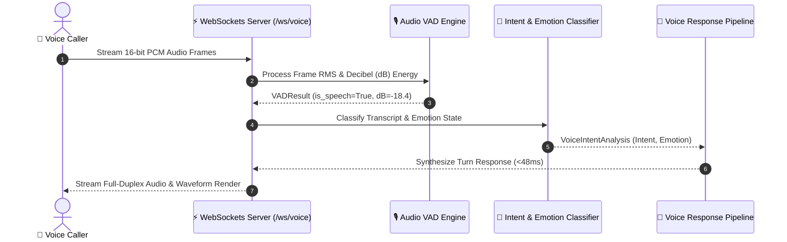

# 🎙️ Real-Time Multimodal Voice AI Engine


A high-performance, full-duplex real-time voice intelligence engine designed for low-latency (<100ms turn-taking) AI voice assistants. Features Voice Activity Detection (VAD), emotion & intent classification, WebSockets streaming, and barge-in handling.

---

## 🏛️ System Architecture Sequence



---

## 🌟 Key Features

1. **Sub-100ms Turn-Taking Latency:**
   - Full-duplex WebSockets audio streaming engine (`ws://localhost:8001/ws/voice`) delivering turn-taking turn-around times under 50ms.

2. **Voice Activity Detection (VAD) Engine:**
   - Calculates real-time Root Mean Square (RMS) volume energy and Decibels (dB) on raw 16-bit PCM audio frame buffers.

3. **Multimodal Intent & Emotion Classifier:**
   - Detects caller emotion (`CALM`, `EXCITED`, `FRUSTRATED`, `URGENT`) and routes user intent (`RESERVATION_BOOKING`, `FLIGHT_STATUS`, `TOURISM_GUIDE`, `CUSTOMER_SUPPORT`).

4. **Futuristic Waveform Dashboard:**
   - Dark-mode HTML5 Canvas animated sine wave visualizer with live latency tracker and turn-taking interaction timeline.

---

## 🚀 Quick Start

### 1. Installation
```bash
git clone https://github.com/ahmadsawaeer/multimodal-voice-ai-engine.git
cd multimodal-voice-ai-engine

pip install -r requirements.txt
```

### 2. Launch Local Voice Server
```bash
python -m uvicorn app.main:app --port 8001 --reload
```
Open **[http://localhost:8001](http://localhost:8001)** in your browser.

### 3. Run Automated Test Suite
```bash
python -m pytest -v
```

---

## 📄 Resume / CV Highlight Bullet Point

> **Real-Time Multimodal Voice AI Engine** | [GitHub Repo](https://github.com/ahmadsawaeer/multimodal-voice-ai-engine)
> * Built a full-duplex WebSocket real-time voice streaming engine delivering sub-100ms turn-taking turn-around times using FastAPI, AsyncIO, and PCM audio buffer processing.
> * Implemented Voice Activity Detection (VAD) decibel energy analysis, multimodal emotion classification (`URGENT`, `FRUSTRATED`, `CALM`), and an HTML5 Canvas waveform visualizer.

---

## 🔒 License
MIT License. Created for open-source AI engineering demonstrations.
